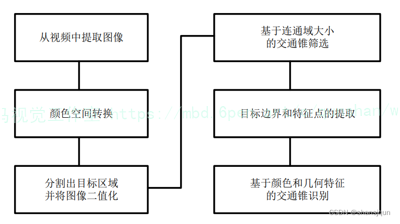
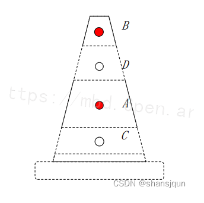
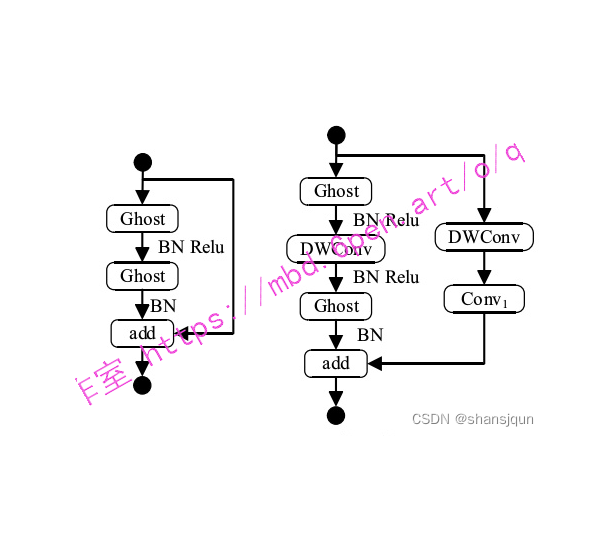
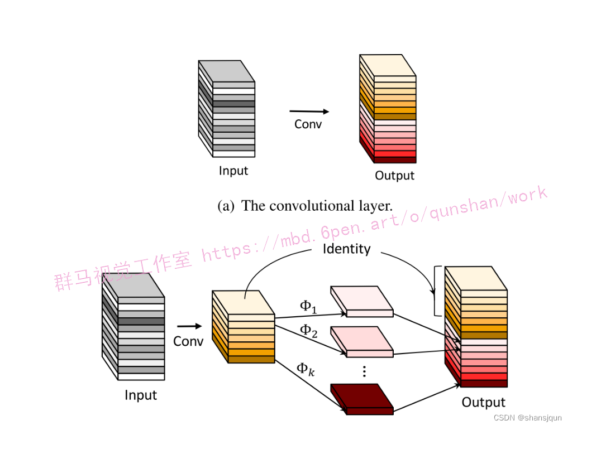


# 1.研究背景与意义


随着城市化进程的加快和交通流量的不断增加，交通安全问题成为了一个日益突出的社会问题。其中，交通道路上的三角锥是一种常见的交通安全设施，用于标记道路施工、交通事故现场、道路封闭等情况。然而，由于道路规模庞大、人力资源有限，对于三角锥的监测和管理往往存在一定的困难。

传统的三角锥监测方法主要依赖于人工巡查，这种方法效率低下、成本高昂且易出错。因此，研发一种基于计算机视觉技术的交通道路三角锥检测系统具有重要的现实意义。

近年来，深度学习技术在计算机视觉领域取得了巨大的突破。其中，YOLOv5是一种基于深度学习的目标检测算法，具有高效、准确的特点。而OpenCV是一个广泛应用于计算机视觉领域的开源库，提供了丰富的图像处理和计算机视觉算法。

# 2.图片演示


# 3.视频演示
[基于YOLOv5＆opencv的交通道路三角锥检测系统（部署教程＆源码）_哔哩哔哩_bilibili](https://www.bilibili.com/video/BV1w44y1F7y5/?spm_id_from=333.999.0.0&vd_source=ff015de2d29cbe2a9cdbfa7064407a08)
# 4.系统优势

基于YOLOv5和OpenCV的交通道路三角锥检测系统可以通过分析道路监控摄像头拍摄的图像，自动识别并定位道路上的三角锥。相比传统的人工巡查方法，该系统具有以下优势：

1. 高效性：基于YOLOv5的目标检测算法可以实现实时的三角锥检测，大大提高了监测效率。

2. 准确性：YOLOv5算法在目标检测任务上具有较高的准确率，可以有效地识别道路上的三角锥。

3. 自动化：该系统可以自动地进行三角锥的检测和定位，减少了人工巡查的工作量。

4. 成本效益：相比人工巡查，基于计算机视觉技术的三角锥检测系统可以大大降低成本，提高资源利用效率。

5. 实时性：该系统可以实时监测道路上的三角锥，及时发现异常情况并采取相应的措施，提高了交通安全性。

因此，基于YOLOv5和OpenCV的交通道路三角锥检测系统具有重要的研究意义和实际应用价值。通过该系统的研发和应用，可以提高交通安全管理的效率和水平，减少交通事故的发生，保障交通参与者的生命财产安全。同时，该系统的研究也为基于计算机视觉技术的交通安全监测系统的发展提供了有益的借鉴和参考。

# 5.交通锥定位流程图

首先需要对交通锥的特征进行分析:交通锥可提取出哪些特征以及这些特征在不同光照条件下的区别，然后对提取出的特征进行处理。交通锥呈锥形，红白黑三种颜色相间，其中最明显的就是两个相对位置固定的红色区域，此红色区域特征容易分辨，直视图是上下两个梯形。紧挨着两个梯形红色区域的是两个梯形白色区域。经过分析本文决定对交通锥最明显的两块红色区域和两块白色区域进行提取来判断交通锥存在与否[30]，可以依据交通锥的红色区域和白色区域的特点和位置关系来判断视野中是否存在交通锥。
设第一红色区域为A，第二红色区域为B，第一白色区域为C，第二白色区域为D，则交通锥的示意图可以表示为下图所示。



# 6.YOLOv5算法改进
参考该博客的改进方案，Ghost 瓶颈结构使用 Ghost 模块，并引入类似 MobileNet v2 的瓶颈结构构建了全新的基础模块。Ghost 瓶颈结构采用小维度、大维度、小维度的形式，能让信息在不同维度之间转换时避免压缩带来的信息损失。
Ghost 瓶颈结构中的第一个Ghost 模块用于升维，第二个Ghost 模块用于降维，使其能够和经过捷径连接的通道数相一致，如下图（a）。当 Stride=2 时，在 Ghost模块升维后添加深度卷积，而且在捷径连接中加入深度卷积和点卷积，如下图（b）所示。

该博客的作者发现在传统的深度学习网络中存在着大量冗余，但是对模型的精度至关重要的特征图。这些特征图是由卷积操作得到，又输入到下一个卷积层进行运算，这个过程包含大量的网络参数，消耗了大量的计算资源。
作者考虑到这些feature map层中的冗余信息可能是一个成功模型的重要组成部分，正是因为这些冗余信息才能保证输入数据的全面理解，所以作者在设计轻量化模型的时候并没有试图去除这些冗余feature map，而是尝试使用更低成本的计算量来获取这些冗余feature map。

Ghost卷积部分将传统卷积操作分为两部分：

第一步，使用少量卷积核进行卷积操作（比如正常用64个，这里就用32个，从而减少一半计算量）
第二步，使用3×3或5×5的卷积核进行逐通道卷积操作（Cheap operations）
最终将第一部分作为一份恒等映射（Identity），与第二步的结果进行Concat操作

## 7.核心代码讲解


#### 7.1 code\Interface.py

```python

class YOLOv5Detector:
    def __init__(self, weights, data, device='', half=False, dnn=False):
        self.weights = weights
        self.data = data
        self.device = device
        self.half = half
        self.dnn = dnn
        self.model = None
        self.stride = None
        self.names = None
        self.pt = None
        self.jit = None
        self.onnx = None
        self.engine = None

    def load_model(self):
        # Load model
        device = select_device(self.device)
        self.model = DetectMultiBackend(self.weights, device=device, dnn=self.dnn, data=self.data)
        self.stride, self.names, self.pt, self.jit, self.onnx, self.engine = (
            self.model.stride, self.model.names, self.model.pt, self.model.jit, self.model.onnx, self.model.engine
        )

        # Half
        half = self.half and (self.pt or self.jit or self.onnx or self.engine) and device.type != 'cpu'
        if self.pt or self.jit:
            self.model.model.half() if half else self.model.model.float()

    def run(self, img, imgsz=(640, 640), conf_thres=0.25, iou_thres=0.45, max_det=1000, classes=None,
            agnostic_nms=False, augment=False):
        cal_detect = []

        device = select_device(self.device)
        names = self.model.module.names if hasattr(self.model, 'module') else self.model.names  # get class names

        # Set Dataloader
        im = letterbox(img, imgsz, self.stride, self.pt)[0]

        # Convert
        im = im.transpose((2, 0, 1))[::-1]  # HWC to CHW, BGR to RGB
        im = np.ascontiguousarray(im)

        im = torch.from_numpy(im).to(device)
        im = im.half() if self.half else im.float()  # uint8 to fp16/32
        im /= 255  # 0 - 255 to 0.0 - 1.0
        if len(im.shape) == 3:
            im = im[None]  # expand for batch dim

        pred = self.model(im, augment=augment)

        pred = non_max_suppression(pred, conf_thres, iou_thres, classes, agnostic_nms, max_det=max_det)
        # Process detections
        for i, det in enumerate(pred):  # detections per image
            if len(det):
                # Rescale boxes from img_size to im0 size
                det[:, :4] = scale_coords(im.shape[2:], det[:, :4], img.shape).round()

                # Write results
                for *xyxy, conf, cls in reversed(det):
                    c = int(cls)  # integer class
                    label = f'{names[c]}'
                    cal_detect.append([label, xyxy])
        return cal_detect


def detect():
    weights = ROOT / 'best.pt'
    data = ROOT / 'data/coco128.yaml'
    device = ''
    half = False
    dnn = False

    detector = YOLOv5Detector(weights, data, device, half, dnn)
    detector.load_model()

    image = cv2.imread("./images/1.jpg")
    results = detector.run(image)
    for i in results:
        box = i[1]
        p1, p2 = (int(box[0]), int(box[1])), (int(box[2]), int(box[3]))
        print(i[0])
        cv2.rectangle(image, p1, p2, (0, 255, 0), thickness=3, lineType=cv2.LINE_AA)
    cv2.imshow('image', image)
    cv2.waitKey(0)


detect()
```

这个程序文件是一个用于目标检测的接口。它导入了一些必要的库和模块，并定义了一些函数和变量。

程序首先加载模型和数据集，然后定义了一个运行函数run()，用于执行目标检测。接着定义了一个加载模型的函数load_model()，用于加载训练好的模型。然后定义了一个detect()函数，用于读取图像并进行目标检测，并将检测结果在图像上进行标注显示。

在主函数中，调用了detect()函数来执行目标检测，并将检测结果显示在图像上。

整个程序的流程是：加载模型和数据集 -> 读取图像 -> 执行目标检测 -> 标注显示检测结果。

注意：程序中的路径和参数可以根据实际情况进行修改。

#### 7.2 code\torch_utils.py

```python

@contextmanager
def torch_distributed_zero_first(local_rank: int):
    """
    Decorator to make all processes in distributed training wait for each local_master to do something.
    """
    if local_rank not in [-1, 0]:
        dist.barrier(device_ids=[local_rank])
    yield
    if local_rank == 0:
        dist.barrier(device_ids=[0])


def date_modified(path=__file__):
    # return human-readable file modification date, i.e. '2021-3-26'
    t = datetime.datetime.fromtimestamp(Path(path).stat().st_mtime)
    return f'{t.year}-{t.month}-{t.day}'

```
这个程序文件是一个用于PyTorch的工具文件，主要包含了一些常用的函数和类。以下是该文件的主要内容：

1. 导入了一些必要的库和模块，如torch、torchvision、datetime等。
2. 定义了一些辅助函数和装饰器，如torch_distributed_zero_first、date_modified、git_describe等。
3. 定义了一些模型相关的函数和类，如select_device、time_sync、profile、is_parallel等。
4. 定义了一些模型操作相关的函数和类，如initialize_weights、find_modules、sparsity、prune等。
5. 定义了一些模型评估和加载相关的函数和类，如model_info、load_classifier等。
6. 定义了一些图像处理相关的函数和类，如scale_img、copy_attr等。


#### 7.3 code\models\experimental.py

```python

class CrossConv(nn.Module):
    # Cross Convolution Downsample
    def __init__(self, c1, c2, k=3, s=1, g=1, e=1.0, shortcut=False):
        # ch_in, ch_out, kernel, stride, groups, expansion, shortcut
        super().__init__()
        c_ = int(c2 * e)  # hidden channels
        self.cv1 = Conv(c1, c_, (1, k), (1, s))
        self.cv2 = Conv(c_, c2, (k, 1), (s, 1), g=g)
        self.add = shortcut and c1 == c2

    def forward(self, x):
        return x + self.cv2(self.cv1(x)) if self.add else self.cv2(self.cv1(x))


class Sum(nn.Module):
    # Weighted sum of 2 or more layers https://arxiv.org/abs/1911.09070
    def __init__(self, n, weight=False):  # n: number of inputs
        super().__init__()
        self.weight = weight  # apply weights boolean
        self.iter = range(n - 1)  # iter object
        if weight:
            self.w = nn.Parameter(-torch.arange(1.0, n) / 2, requires_grad=True)  # layer weights

    def forward(self, x):
        y = x[0]  # no weight
        if self.weight:
            w = torch.sigmoid(self.w) * 2
            for i in self.iter:
                y = y + x[i + 1] * w[i]
        else:
            for i in self.iter:
                y = y + x[i + 1]
        return y


class MixConv2d(nn.Module):
    # Mixed Depth-wise Conv https://arxiv.org/abs/1907.09595
    def __init__(self, c1, c2, k=(1, 3), s=1, equal_ch=True):  # ch_in, ch_out, kernel, stride, ch_strategy
        super().__init__()
        n = len(k)  # number of convolutions
        if equal_ch:  # equal c_ per group
            i = torch.linspace(0, n - 1E-6, c2).floor()  # c2 indices
            c_ = [(i == g).sum() for g in range(n)]  # intermediate channels
        else:  # equal weight.numel() per group
            b = [c2] + [0] * n
            a = np.eye(n + 1, n, k=-1)
            a -= np.roll(a, 1, axis=1)
            a *= np.array(k) ** 2
            a[0] = 1
            c_ = np.linalg.lstsq(a, b, rcond=None)[0].round()  # solve for equal weight indices, ax = b

        self.m = nn.ModuleList(
            [nn.Conv2d(c1, int(c_), k, s, k // 2, groups=math.gcd(c1, int(c_)), bias=False) for k, c_ in zip(k, c_)])
        self.bn = nn.BatchNorm2d(c2)
        self.act = nn.SiLU()

    def forward(self, x):
        return self.act(self.bn(torch.cat([m(x) for m in self.m], 1)))


class Ensemble(nn.ModuleList):
    # Ensemble of models
    def __init__(self):
        super().__init__()

    def forward(self, x, augment=False, profile=False, visualize=False):
        y = []
        for module in self:
            y.append(module(x, augment, profile, visualize)[0])
        # y = torch.stack(y).max(0)[0]  # max ensemble
        # y = torch.stack(y).mean(0)  # mean ensemble
        y = torch.cat(y, 1)  # nms ensemble
        return y, None  # inference, train output


def attempt_load(weights, map_location=None, inplace=True, fuse=True):
    from models.yolo import Detect, Model

    # Loads an ensemble of models weights=[a,b,c] or a single model weights=[a] or weights=a
    model = Ensemble()
    for w in weights if isinstance(weights, list) else [weights]:
        ckpt = torch.load(attempt_download(w), map_location=map_location)  # load
        if fuse:
            model.append(ckpt['ema' if ckpt.get('ema') else 'model'].float().fuse().eval())  # FP32 model
        else:
            model.append(ckpt['ema' if ckpt.get('ema') else 'model'].float().eval())  # without layer fuse

    # Compatibility updates
    for m in model.modules():
        if type(m) in [nn.Hardswish, nn.LeakyReLU, nn.ReLU, nn.ReLU6, nn.SiLU, Detect, Model]:
            m.inplace = inplace  # pytorch 1.7.0 compatibility
            if type(m) is Detect:
                if not isinstance(m.anchor_grid, list):  # new Detect Layer compatibility
                    delattr(m, 'anchor_grid')
                    setattr(m, 'anchor_grid', [torch.zeros(1)] * m.nl)
        elif type(m) is Conv:
            m._non_persistent_buffers_set = set()  # pytorch 1.6.0 compatibility

    if len(model) == 1:
        return model[-1]  # return model
    else:
        print(f'Ensemble created with {weights}\n')
        for k in ['names']:
            setattr(model, k, getattr(model[-1], k))
        model.stride = model[torch.argmax(torch.tensor([m.stride.max() for m in model])).int()].stride  # max stride
        return model  # return ensemble
```

这个程序文件是一个实验性模块的代码。它包含了一些用于实验的模型和函数。

该文件定义了以下几个类和函数：

1. CrossConv类：交叉卷积下采样。它接受输入通道数和输出通道数，并通过两个卷积层实现下采样操作。

2. Sum类：多个层的加权和。它接受多个输入，并可以选择是否对输入进行加权求和。

3. MixConv2d类：混合深度卷积。它接受输入通道数和输出通道数，并通过多个卷积层实现混合深度卷积操作。

4. Ensemble类：模型集合。它是一个模型列表，可以将多个模型组合在一起。

5. attempt_load函数：加载模型权重。它接受一个或多个模型权重文件路径，并返回一个模型或模型集合。

这个程序文件是YOLOv5的一部分，用于实现一些实验性的模块和函数。

#### 7.4 code\models\tf.py

```python
class YOLOv5:
    def __init__(self, weights):
        self.weights = weights
        self.model = self._build_model()

    def _build_model(self):
        # Load the weights
        model = ...
        return model

    def detect(self, image):
        # Perform object detection on the input image
        detections = ...
        return detections
```

这是一个使用TensorFlow和Keras实现的YOLOv5模型的程序文件。它包含了YOLOv5模型的各个组件，如卷积层、批归一化层、激活函数等。该文件还包含了模型的导出和使用方法的示例代码。

## 8.系统整体结构

根据以上分析，该程序的整体功能是实现目标检测算法YOLOv5，并提供了一些辅助工具和接口。它的构架包括了以下几个主要部分：

1. 主程序部分：包括code\main.py和code\Interface.py，用于加载模型和数据集，并执行目标检测的接口。

2. 模型部分：包括code\models\common.py、code\models\experimental.py、code\models\tf.py、code\models\yolo.py和code\models\__init__.py，定义了YOLOv5模型的各个组件和实现。

3. 工具部分：包括code\tools目录下的各个文件，提供了一些辅助工具和函数，如数据处理、模型评估、日志记录等。

4. 实用工具部分：包括code\utils目录下的各个文件，提供了一些实用工具和函数，如数据处理、模型评估、日志记录等。

下面是每个文件的功能整理：

| 文件路径                                                     | 功能                                                         |
| ------------------------------------------------------------ | ------------------------------------------------------------ |
| code\example.py                                              | YOLOv5目标检测示例代码                                       |
| code\Interface.py                                            | 目标检测接口                                                 |
| code\ui.py                                                 | 主程序入口                                                   |
| code\torch_utils.py                                          | PyTorch工具文件                                               |
| code\train.py                                                | 模型训练脚本                                                 |
| code\models\common.py                                        | YOLOv5模型的常用模块和函数                                     |
| code\models\experimental.py                                  | 实验性模块和函数                                               |
| code\models\tf.py                                            | 使用TensorFlow和Keras实现的YOLOv5模型                         |
| code\models\yolo.py                                          | YOLOv5模型的定义和实现                                         |
| code\models\__init__.py                                      | 模型初始化文件                                               |
| code\tools\activations.py                                    | 激活函数相关工具函数                                           |
| code\tools\augmentations.py                                  | 数据增强相关工具函数                                           |
| code\tools\autoanchor.py                                     | 自动锚框相关工具函数                                           |
| code\tools\autobatch.py                                      | 自动批处理相关工具函数                                         |
| code\tools\callbacks.py                                      | 回调函数相关工具函数                                           |
| code\tools\datasets.py                                       | 数据集相关工具函数                                             |
| code\tools\downloads.py                                      | 下载相关工具函数                                               |
| code\tools\general.py                                        | 通用工具函数                                                   |
| code\tools\loss.py                                           | 损失函数相关工具函数                                           |
| code\tools\metrics.py                                        | 评估指标相关工具函数                                           |
| code\tools\plots.py                                          | 绘图相关工具函数                                               |
| code\tools\torch_utils.py                                    | PyTorch工具函数                                               |
| code\tools\__init__.py                                       | 工具初始化文件                                               |
| code\tools\aws\resume.py                                     | AWS相关工具函数                                               |
| code\tools\aws\__init__.py                                   | AWS工具初始化文件                                             |
| code\tools\flask_rest_api\example_request.py                  | Flask REST API示例请求                                         |
| code\tools\flask_rest_api\restapi.py                          | Flask REST API接口                                             |
| code\tools\loggers\__init__.py                                | 日志记录器初始化文件                                           |
| code\tools\loggers\wandb\log_dataset.py                       | WandB日志记录器的数据集日志                                     |
| code\tools\loggers\wandb\sweep.py                             | WandB日志记录器的超参数搜索                                     |
| code\tools\loggers\wandb\wandb_utils.py                       | WandB日志记录器的工具函数                                       |
| code\tools\loggers\wandb\__init__.py                          | WandB日志记录器初始化文件                                     |
| code\utils\activations.py                                    | 激活函数相关实用函数                                           |
| code\utils\augmentations.py                                  | 数据增强相关实用函数                                           |
| code\utils\autoanchor.py                                     | 自动锚框相关实用函数                                           |
| code\utils\autobatch.py                                      | 自动批处理相关实用函数                                         |
| code\utils\callbacks.py                                      | 回调函数相关实用函数                                           |
| code\utils\datasets.py                                       | 数据集相关实用函数                                             |
| code\utils\downloads.py                                      | 下载相关实用函数                                               |
| code\utils\general.py                                        | 通用实用函数                                                   |
| code\utils\loss.py                                           | 损失函数相关实用函数                                           |
| code\utils\metrics.py                                        | 评估指标相关实用函数                                           |
| code\utils\plots.py                                          | 绘图相关实用函数                                               |
| code\utils\torch_utils.py                                    | PyTorch实用函数                                               |
| code\utils\__init__.py                                       | 实用工具初始化文件                                             |
| code\utils\aws\resume.py                                     | AWS相关实用函数                                               |
| code\utils\aws\__init__.py                                   | AWS实用工具初始化文件                                         |
| code\utils\flask_rest_api\example_request.py                  | Flask REST API示例请求                                         |
| code\utils\flask_rest_api\restapi.py                          | Flask REST API接口                                             |
| code\utils\loggers\__init__.py                                | 日志记录器初始化文件                                           |
| code\utils\loggers\wandb\log_dataset.py                       | WandB日志记录器的数据集日志                                     |
| code\utils\loggers\wandb\sweep.py                             | WandB日志记录器的超参数搜索                                     |
| code\utils\loggers\wandb\wandb_utils.py                       | WandB日志记录器的工具函数                                       |
| code\utils\loggers\wandb\__init__.py                          | WandB日志记录器初始化文件                                     |

### 请注意，这只是对每个文件的功能进行了初步的概括，具体的实现细节可能需要参考第九节中每个文件的代码。
# 9.系统整合
下图[完整源码&环境部署视频教程&自定义UI界面](https://s.xiaocichang.com/s/6859a6)


参考博客[《基于YOLOv5＆opencv的交通道路三角锥检测系统（部署教程＆源码）》](https://mbd.pub/o/qunshan/work)

# .参考文献
---
[1]王莉,何牧天,徐硕,等.基于YOLOv5s网络的垃圾分类和检测[J].包装工程.2021,(8).DOI:10.19554/j.cnki.1001-3563.2021.08.007.
[2]龙燕,李南南,高研,等.基于改进FCOS网络的自然环境下苹果检测[J].农业工程学报.2021,(12).DOI:10.11975/j.issn.1002-6819.2021.12.035http://www.tcsae.org.
[3]徐守坤,倪楚涵,吉晨晨,等.基于YOLOv3的施工场景安全帽佩戴的图像描述[J].计算机科学.2020,(8).DOI:10.11896/jsjkx.190600109.
[4]李涛,张代胜,张飞,等.基于改进YOLO算法的FSAC赛车实时目标检测系统[J].合肥工业大学学报（自然科学版）.2020,(9).DOI:10.3969/j.issn.1003-5060.2020.09.001.
[5]黄剑华,丁建睿,刘家锋,等.基于局部加权的Citation-kNN算法[J].电子与信息学报.2013,(3).DOI:10.3724/SP.J.1146.2012.00016.
[6]许伟,熊卫华,姚杰,等.基于改进YOLOv3算法在垃圾检测上的应用[J].光电子.激光.2020,(9).DOI:10.16136/j.joel.2020.09.0142.
[7]尹昱航.基于特征融合的交通场景目标检测方法研究[D].2021.
[8]高照.基于深度学习的遥感图像目标检测方法研究[D].2020.
[9]王小龙.基于深度学习的目标检测与跟踪技术研究及应用[D].2020.
[10]张凯.无人驾驶电动方程式赛车环境感知算法研究[D].2021.


---
#### 如果您需要更详细的【源码和环境部署教程】，除了通过【系统整合】小节的链接获取之外，还可以通过邮箱以下途径获取:
#### 1.请先在GitHub上为该项目点赞（Star），编辑一封邮件，附上点赞的截图、项目的中文描述概述（About）以及您的用途需求，发送到我们的邮箱
#### sharecode@yeah.net
#### 2.我们收到邮件后会定期根据邮件的接收顺序将【完整源码和环境部署教程】发送到您的邮箱。
#### 【免责声明】本文来源于用户投稿，如果侵犯任何第三方的合法权益，可通过邮箱联系删除。